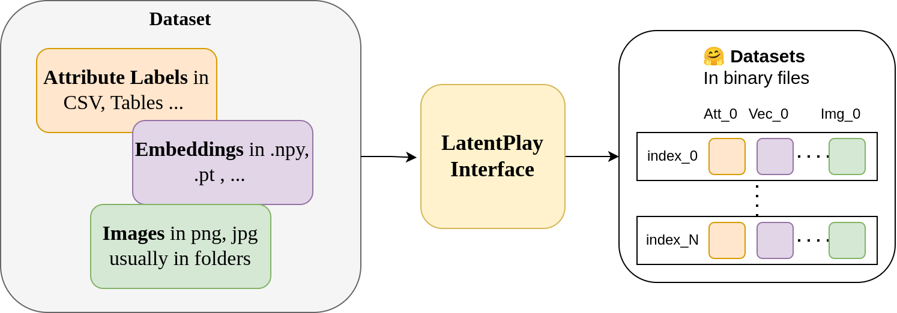
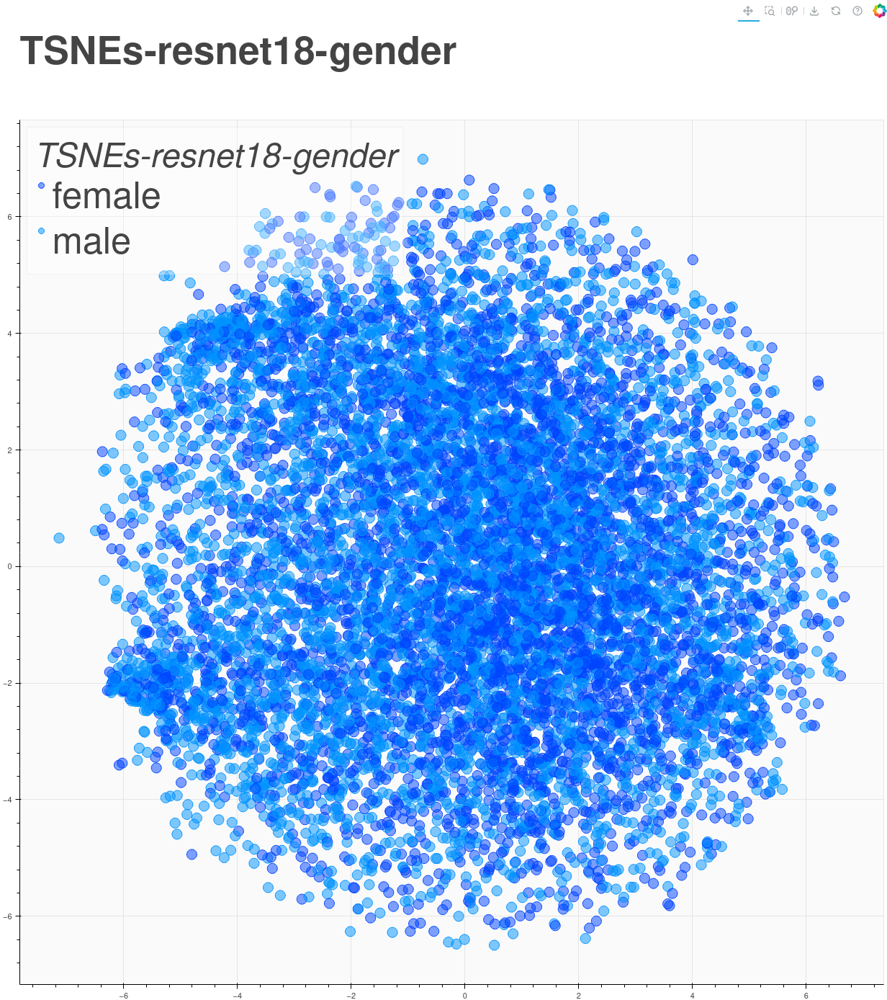
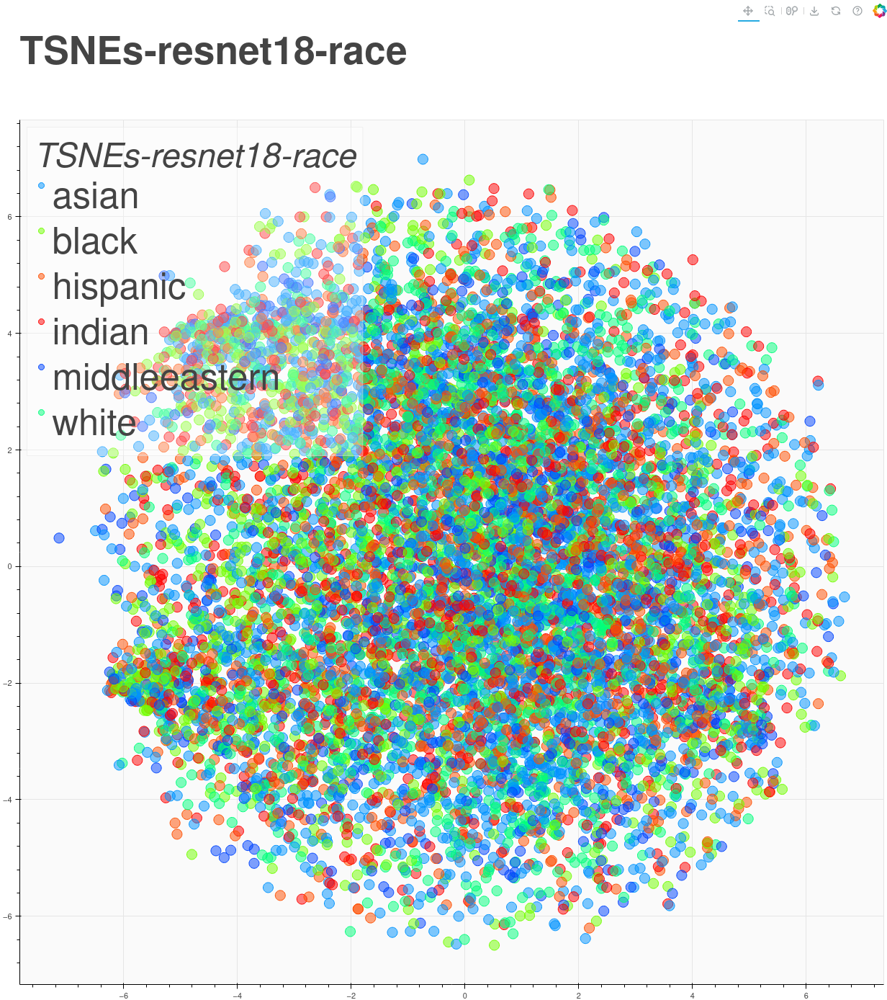

# LatentPlay Interface



Assume that you have a dataset of images and multiple labels for each of the images, for example, images of human faces and their corresponding labels like the gender, race and age of the person, or images of objects with their corresponding name from discrete set of possible values. Now consider the case that we want to calculate the embedding of each of the images using different algorithms, or store the post-processed versions of the images, the practice now is to store each of these data types in different files or folders (for example an .npy file for embeddings and a separate folder to save the post-processed images and save the path to the folder in the csv file), here we introducing a way to unify all of this storage and reusability issues using our proposed `LatentPlay` interface which tries to simplify this process using the 🤗 [Datasets](https://huggingface.co/docs/datasets/en/index) library.  


## TLDR: 
A **practice** to handle multi-modal datasets in a unified way.

This folder contains scripts to convert various datasets to my unified latentplay interface based on  `huggingfaces dataset` for facilitating further experimentation with minimal code changes. You can also find some sample usages in next sections.

Currently it supports following datasets: 
- [FairFace](https://github.com/joojs/fairface)
- [MORPH](https://ieeexplore.ieee.org/document/1613043)
- [RFW](http://www.whdeng.cn/RFW/index.html)
- [UTKFace](https://susanqq.github.io/UTKFace/)

Pull requests are welcomed 🤝🏻.

Given the path to the original datasets as they originally published, it will generate the `.hf` folder with the datasets packed into a binary files.

**Note**: The scripts designed for the original distribution of datasets (in terms of folder hierarchy) by the corresponding authors. 

Later you can simple load the dataset in your python script like: 
```python
from datasets import load_from_disk 
dataset = load_from_disk('path/to/your/dataset.hf')
```


## Getting Started 
Creating conda environment
```bash
mamba/conda/micromamba create -f ./env.yaml
mamba activate latentplay
```


## Making LatentPlay version of Fairface [OPTIONAL] 

Downloading the [FairFace](https://drive.google.com/file/d/1Z1RqRo0_JiavaZw2yzZG6WETdZQ8qX86/view) dataset.

We provide a helper script for that, just run:
```bash
chmod +x ./scripts/download_fairface.sh
download_fairface.sh
```

I also provide the preprocessed version of this dataset you can download it from release.


# Playing around with the dataset
Now that you have a dataset and all of its metadata you can play around with it, for example, adding new column to the dataset in terms of the embeddings of the images (yes you can add vectors to the datasets which already contains images, meta data in different formats!!) so its make it easy for us to manage our experiments. 

## Sample#1: Adding Embedding as a new column
Following script will extract the embedding of the `image` column in our dataset and save it in new `resnet18` column.
Optionally you can download the dataset with pre-calculated embedding from release.

```bash
python3 add_embedding.py datasets/fairface2latentplay.hf
```

The new dataset with the new embedding column will be saved next to the original one.


## Sample#2: Visualization of the dataset using t-SNE
Now that we have both embedding, and their corresponding labels in a **unified dataset**, lets see how we can draw a `t-SNE` plot from embeddings according to different attribute groups (e.g.  gender, race, ...).

```bash
python3 visualization.py --multirun vis=resnet18  
```
The plots will be saved next to the dataset path.

Or you can do the same for the `race` column in the dataset.
```bash 
python3 visualization.py --multirun vis=resnet18 vis.label_keys=['race']  
```

| Gender                              | Race           |
|--------------------------------------|--------------------------------------|
| | |


We can also draw the plots using `umap`. in this case you can run:
```bash
python3 visualization.py --multirun vis=resnet18 vis.proj_algorithm=umap
```

# TODO: 
Add more sample use cases ...

# Citation
If you found this framework useful please consider citing our paper. 

```bibtex
@inproceedings{rahimi2023toward,
  title={Toward responsible face datasets: modeling the distribution of a disentangled latent space for sampling face images from demographic groups},
  author={Rahimi, Parsa and Ecabert, Christophe and Marcel, S{\'e}bastien},
  booktitle={2023 IEEE International Joint Conference on Biometrics (IJCB)},
  pages={1--11},
  year={2023},
  organization={IEEE}
}
```